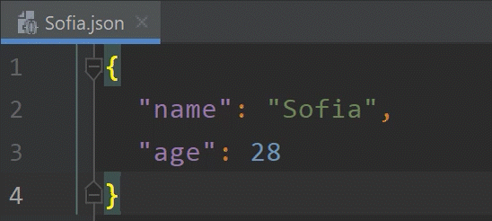
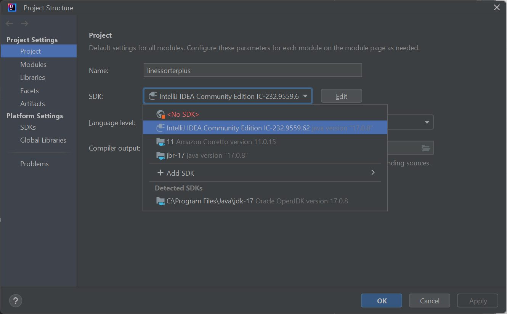

# Lines Sorter Plus

Lines Sorter Plus is a plugin for the IntelliJ Platform (IDEA, WebStorm, PhpStorm, etc.) which alphabetically sorts texts and JSON objects. This plugin is based on Sylvain Francois' [Lines Sorter](https://plugins.jetbrains.com/plugin/5919-lines-sorter) and emerged from [this discussion](https://github.com/syllant/idea-plugin-linessorter/issues/16).

## Usage & Installation

Just click on "Edit" and select "Lines Sorter Plus" after you installed this plugin from the [JetBrains Marketplace](https://plugins.jetbrains.com/).

You can also activate "Lines Sorter Plus" by pressing `Alt + Shift + L`:



**Info:** The plugin differentiates between "selection mode" and "file mode". When you select code with your cursor, then the plugin will format the selected lines of code in "selection mode". When you have no active selection, then the plugin will sort your whole file in "file mode". It supports sorting plaintext and JSON structures (in \*.json files).

## Development Instructions

### Prerequisites

- [Amazon Corretto 11](https://aws.amazon.com/corretto/) (OpenJDK)
- IntelliJ IDEA 2021.3.1 (Community Edition) or later
- Activated [DevKit Plugin](https://plugins.jetbrains.com/docs/intellij/welcome.html)

Click "Open Module Settings (F4)" to see your attached SDKs. You need to use Java SDK 11 when targeting IntelliJ IDEA 2020.3 or later ([source](https://plugins.jetbrains.com/docs/intellij/setting-up-environment.html#configuring-intellij-platform-sdk)).

### Common Errors

When using a non-fitting JDK, you will see:

> Error:java: release version 5 not supported

When using a newer JDK (e.g. Oracle OpenJDK 17.0.1), you will run into:

> com.intellij.ide.plugins.StartupAbortedException: UI initialization failed

When you don't have an "[IntelliJ Platform Plugin SDK](https://plugins.jetbrains.com/docs/intellij/setting-up-theme-environment.html#add-intellij-platform-plugin-sdk)" assigned to this project, the code will fail to import from **com.intellij** or **org.jetbrains**:

> java: package com.intellij.openapi.actionSystem does not exist

This can be fixed by navigating to "File" - "Project Structure". You should see an "SDK" section where you have to select an "IntelliJ IDEA Community Edition" SDK. If you don't have any, click on "Add SDK" and select "IntelliJ Platform Plugin SDK" (tested with IntelliJ IDEA 2023.2.1, Community Edition):



### Compatibility

Build and tested with:

- IntelliJ IDEA 2021.3.1 (Community Edition)

Created with the following template:

- File ➝ New ➝ Project ➝ IntelliJ Platform Plugin (without Gradle)

### Logging

When running the plugin, a Sandbox IDE will be started which has the plugin installed. Here is how you can view the logs (with "info" log level) on your system.

With Windows PowerShell:

```
Get-Content -Path "C:\Users\bn\AppData\Local\JetBrains\IdeaIC2021.3\plugins-sandbox\system\log\idea.log" -Wait
```

### Formatting

Code formatting is done with [Prettier](https://prettier.io/) which gets installed through [npm](https://www.npmjs.com/):

```bash
npm install
npm run fix
```

Staged files in Git get automatically formatted with [pretty-quick](https://github.com/azz/pretty-quick).

## Deployment

1. Select plugin in the "Project" window
2. Do a right-click and select "Prepare Plugin Module For Deployment"
3. Publish .jar file on [JetBrains Marketplace](https://plugins.jetbrains.com/plugin/add#intellij)

### Resources

- [Setting Up a Development Environment](https://plugins.jetbrains.com/docs/intellij/setting-up-environment.html#configuring-intellij-platform-sdk)
- [Building a Plugin for WebStorm – Tutorial for JavaScript Developers](https://blog.jetbrains.com/webstorm/2021/09/building-a-plugin-for-webstorm-part-1/)
- [Creating Your First Plugin](https://plugins.jetbrains.com/docs/intellij/getting-started.html)
- [Publishing a Plugin](https://plugins.jetbrains.com/docs/intellij/publishing-plugin.html)
- [Compatibility verification tool for IntelliJ Platform plugins](https://github.com/JetBrains/intellij-plugin-verifier)
- [Build Number Ranges](https://plugins.jetbrains.com/docs/intellij/build-number-ranges.html)
- [Plugin Logo Requirements](https://plugins.jetbrains.com/docs/intellij/plugin-icon-file.html#plugin-logo-requirements)
